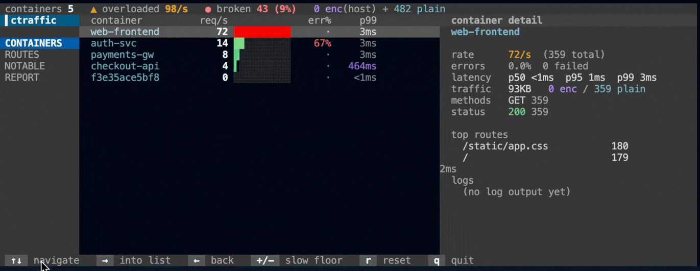

# `containertraffic`

> **htop for your containers' HTTP.** Every request each container serves, ranked by what's actually wrong with it.

<p align="center">
  
  
  
  
  <a href="https://discord.gg/dYZu9PjKB"></a>
</p>



**`containertraffic` is a live, zero-config dashboard that shows every container's HTTP traffic, attributed to the container by cgroup and read straight from the kernel with eBPF.**

> [!TIP]
> No sidecar, no proxy, no app changes. It reads HTTP at the socket layer and tags each request with the kernel's cgroup id, so the per-container split comes from the kernel rather than from a service mesh you had to install first.

## Quick start

```sh
curl -fsSL https://yeet.cx | sh
yeet run github:yeet-src/containertraffic
```
<sub>[Manual install guide](https://yeet.cx/docs/install/manual-installation) | Linux only</sub>

Switch views with the number keys (`1` Containers, `2` Routes, `3` Notable, `4` Report) or `Tab`. `↑` / `↓` moves the cursor and the detail pane on the right follows it; on the Containers tab that pane also tails the selected container's logs. `+` / `-` tunes the slow-request threshold on the Notable tab. `q` quits.

## A 60-second primer on watching container HTTP

A container is just a process in its own cgroup. Its HTTP requests leave through the same kernel socket calls as any other process; the only thing that ties a request to "the checkout container" is which cgroup the calling task belongs to. `containertraffic` reads both: the HTTP off the socket, and the cgroup off the task.

| Term | What it means here |
|---|---|
| **cgroup** | The kernel's grouping for a container's processes. On cgroup v2 a Docker container's leaf is named for its 64-char container id, which is how a request gets attributed to a named container. |
| **kprobe** | A kernel hook on a function. `containertraffic` hooks `tcp_sendmsg` (the request) and `tcp_recvmsg` (the response) to read HTTP as the kernel moves it. |
| **uprobe** | A hook on a *userspace* function. `containertraffic` hooks `SSL_write` / `SSL_read` in the host TLS library to read HTTPS as plaintext, before encryption and after decryption. |
| **RED** | Rate, Errors, Duration. The three signals a request-driven service is judged by, framed here as the three ways a service gets sick: **broken** (errors), **overloaded** (rate), **slow** (tail latency). |
| **route pattern** | A path with its variable parts collapsed: `/users/1839` and `/users/204` both become `/users/{id}`. How requests get grouped without the cardinality exploding. |

The trick that makes `containertraffic` cheap: it never sits in the request path. It watches the kernel's socket and TLS calls, so the container serves traffic exactly as it would if the tool were not running.

## Common use cases

Backend developers debugging which container is misbehaving under load, and SREs watching a host full of services without standing up a mesh to do it.

Where you'd normally reach for a service mesh's dashboard or a per-container `docker logs` tail plus a metrics scrape, `containertraffic` reads the HTTP and the attribution straight from the kernel, so you get per-container rate, errors, and latency with nothing injected into the containers.

- A deploy went out and error rates moved. Which container is returning the 5xxs?
- One host runs a dozen services. Which one is slow right now, and on which route?
- p99 climbed but the average looks fine. Which endpoint is dragging the tail?
- A container is throwing 500s. What is it actually printing to its logs as it fails?

## What you're looking at

The screen is a three-column layout: a vertical tab rail on the left, the active view in the middle, and a detail pane on the right that tracks whatever row you have selected.

- **Status strip (top).** The live headline across all containers: total request rate (overloaded), error count and percentage (broken), and the encrypted-versus-plaintext split.
- **Containers tab.** The headline census, one row per container, ranked by request rate. Each row carries req/s, an error rate, and p99 latency. Selecting a container fills the detail pane with its full RED breakdown (p50/p95/p99, method mix, status mix, bytes), its top routes, and a live tail of its logs. This is the "click in to see what this service is doing" view.
- **Routes tab.** Every route pattern across all containers, ranked by volume, with error rate and p99. The detail pane shows which containers serve the selected route. This is the cross-cutting lens: which endpoint is hot or failing, regardless of who owns it.
- **Notable tab.** A triage queue, not a firehose. Only requests worth a look land here: errors and anything slower than the threshold. New rows arrive at the top but the view holds still on your selection so you can read it, and the detail pane shows the selected request in full. `+` / `-` raises or lowers the slow threshold; the header says how many ordinary requests were elided, so the tab is honest about what it is hiding.
- **Report tab.** The opinionated summary: a ranked list of findings tagged **broken**, **overloaded**, or **slow**, worst first, with the selected finding's evidence in the detail pane. This is the part that reads the data for you instead of making you read it.

## How it works

Three layers: a single BPF object, a BPF-aware data layer in JS, and pure UI that reads signals.

**The BPF side.** One object, `bin/probe.bpf.o`, linked from `src/bpf/containertraffic.bpf.c`, with six programs feeding one ring buffer. Each event carries the cgroup id and name, the method, path, status, latency, byte counts, and a source tag (wire or TLS).

| Program | Hook | What it captures |
|---|---|---|
| `on_sendmsg` | `kprobe/tcp_sendmsg` | The outgoing request. Parses the HTTP request line (method, path) and stashes it by socket. |
| `on_recvmsg` / `on_recvmsg_ret` | `kprobe` + `kretprobe` on `tcp_recvmsg` | The response. Reads the reply buffer on return, lifts the status code, pairs it with the stashed request for latency. |
| `on_ssl_write` | `uprobe/SSL_write` | The request inside TLS, read as plaintext before encryption. |
| `on_ssl_read` | `uprobe/SSL_read` | The response inside TLS, read as plaintext after decryption; lifts the status code. |

Attribution is read in-kernel: each request site records the task's leaf cgroup name, which on cgroup v2 contains the container id. A slow-request floor lives in the program's `.bss` as a live knob; userspace patches it so the kernel does the filtering.

**The JS side.** One ring-buffer subscription, rolled into the views.

- `src/probes/probe.js` loads the object and attaches the programs once.
- `src/probes/containertraffic.js` subscribes to the ring buffer and aggregates every request into RED metrics per container and per route, with latency tracked as percentiles from a recent-sample reservoir.
- `src/probes/logs.js` streams a selected container's stdout/stderr (this is the only piece that is not eBPF; it reads the daemon's container-logs API).
- `src/lib/containers.js` resolves a cgroup name to a container name by matching the embedded id against the running container list.
- `src/lib/report.js` is `analyze()`, the broken/overloaded/slow heuristics behind the Report tab.
- `src/components/*.jsx` are pure UI reading signals; `src/lib/{format,theme,layout}.js` are pure helpers.

## Requirements

> [!IMPORTANT]
> A Linux kernel built with BTF (`CONFIG_DEBUG_INFO_BTF=y`), which is the default on recent Ubuntu, Debian, Fedora, and Amazon Linux. eBPF needs root; the yeet daemon handles the privileged load.

The yeet daemon, which handles the privileged BPF load. `curl -fsSL https://yeet.cx | sh` installs it.

Container attribution to a *named* container reads the running container list from the daemon's container API, so names resolve for Docker containers; traffic from anything else is bucketed honestly as `host`. (extrapolated, grounding 2 — review: tested against Docker; other runtimes that use the same cgroup-id-in-leaf convention should resolve too but were not verified.)

## Honest caveats

> [!NOTE]
> What `containertraffic` does not do, and what it gets wrong.

- **HTTP/1.x only.** HTTP/2's binary HPACK framing is not decoded; that traffic shows nothing rather than garbage. (Many clients negotiate h2 by default over TLS; forcing HTTP/1.1 makes the traffic visible.)
- **Containerized TLS is not captured.** The `SSL_write` / `SSL_read` uprobes attach to the *host's* `libssl`. A container that ships its own `libssl` inside its image is a different library the host-side uprobe cannot hook, so encrypted traffic resolves for host processes on the system `libssl`, not for in-container HTTPS. The status strip marks this: `enc(host)` when the probe is attached, `enc(off)` if it could not attach. Plaintext is attributed for containers regardless. (extrapolated, grounding 2 — review: this is a current limit of the uprobe binding, which targets a library by name and has no per-container or per-pid attach.)
- **Statically-linked TLS has no `libssl` to hook.** Go binaries and other static-TLS builds will not show their HTTPS on the TLS path.
- **Logs need a real container.** The log tail reads the container-logs API, so it works for Docker containers; the `host` bucket and non-container cgroups have nothing to show.
- **Latency on a local round trip reads `<1ms`.** Percentiles come alive on real network paths; loopback traffic will mostly show sub-millisecond durations.

## Community questions

**Do I need a service mesh or a sidecar to get per-container HTTP?**
No. The per-container split is read from the kernel's cgroup id on each request. There is nothing to inject into the containers and nothing in the request path.

**Will running this slow down my containers?**
It is not in the request path. It reads the kernel's existing socket and TLS calls, so a container serves traffic the same whether the tool is running or not. (extrapolated, grounding 3 — review: overhead is the standard kprobe/uprobe-plus-ringbuf cost; no benchmark numbers are claimed here.)

**Why is the encrypted column zero for my containers?**
The TLS uprobe attaches to the host `libssl`, and most containers ship their own. In-container HTTPS is not captured in this version; the status strip shows `enc(host)` to make the scope explicit. Plaintext HTTP is still attributed per container.

**Is it safe to run on a shared host?**
It reads only HTTP metadata and container logs from the kernel and the daemon; it does not modify traffic or inject into containers. (extrapolated, grounding 3 — review: a security/appropriateness claim worth an engineer's confirmation before publishing.)

**How is this different from `docker stats` or a metrics dashboard?**
`docker stats` shows CPU, memory, and network bytes, not HTTP. A metrics dashboard shows what the service was instrumented to emit. `containertraffic` shows the actual requests, methods, paths, status codes, and latency, with no instrumentation, read from the kernel.

## Building from source

```sh
make          # clang + bpftool build the BPF object, esbuild bundles the JS
make clean
```

The toolchain (clang, bpftool, esbuild) is vendored by the yeet build setup; on macOS the BPF build runs in a Linux VM. The compiled object (`bin/probe.bpf.o`), the bundled `src/index.jsx`, and the generated `vmlinux.h` are gitignored and rebuilt by `make`.

## License

The BPF program declares `char LICENSE[] SEC("license") = "Dual BSD/GPL"`, the dual marker that lets it call GPL-only kernel helpers. (extrapolated, grounding 2 — review: badged GPL-2.0 to match the sibling scripts; there is no `LICENSE` file in the repo yet, so the project-level license should be confirmed and a file added.)

---

Built with [yeet](https://yeet.cx/docs/?utm_source=github&utm_medium=readme&utm_campaign=containertraffic), a JS runtime for writing eBPF programs on Linux machines. Join us on [discord](https://discord.gg/dYZu9PjKB?utm_source=github&utm_medium=readme&utm_campaign=containertraffic).
